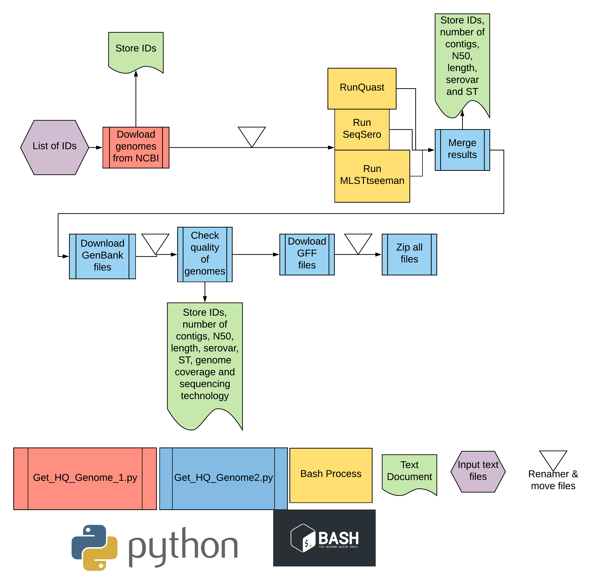

Authors: ILANGO Guy , Cherchame Emeline  
Version : 1.3  
Credit : Anses ILANGO G., CHERCHAME E., CADEL SIX S.   
-----------------------------------------------
salMOnella Download gEnome Serotype sT  
 <b>MODEST
-----------------------------------------------

MODEST is made for downloading Salmonella complete genomes or contigs from NCBI. It will apply quality filters and generate a report text file for each filter.
Get_HQ_Genome_1.py is used to download fasta file from IDs list and rename them.
Get_HQ_Genome2.py is used to download gbk and gff file from ID list and rename them.
Please note that : "mlst tseeman" can be easily setup for Salmonella
"renamer" tool works only with Salmonella genomes, however it can be easily modify to retrieve Species_ST_Accession
SeqSero prediction works only with Salmonella genomes, for other microorganisms a confirmation tool on genus/species is needed. 

-------------
Prerequisites
-------------

Make sure that you have installed ncbi-genome-download, ncbi-acc-download (https://github.com/kblin/ncbi-genome-download),
Quast (http://bioinf.spbau.ru/quast), MLSTtseeman (https://github.com/tseemann/mlst)
and SeqSero2 (https://github.com/denglab/SeqSero2) before run the pipeline.

Python3.5 is used on this pipeline. 

 
You need to register to ncbi to get your api_key (https://ncbiinsights.ncbi.nlm.nih.gov/2017/11/02/new-api-keys-for-the-e-utilities/).


-------------
Licence
-------------
MODEST was design and developed within Anses Food Safety Laboratory of Maisons-Alfort (France)

--------------------
Descriptive diagram
--------------------
The list of IDs is given to the first python script, genomes will then be downloaded and then process bu SeqSero and MLSTtseeman.
The result of these bash processes will be given to the second python script. This script will download genbank and gff, check the quality of genomes and zip all files.
    

-------------
How it work
------------
Works with complete genome 

```
python3.5 Get_HQ_Genome1.py -i myIDslist.txt -m g -api myapikey

python3.5 Get_HQ_Genome_2.py -d myIDslist.txt -m g -f n -api myapikey
```
-------------
User Manual
-------------

*******************
Get_HQ_Genome_1.py
*******************
The input file is a text file, from NCBI query or compiled by users, listing the IDs of contigs or complete genomes to be downloaded.
In the example below it is called "myIDslist.txt"
example: Get_HQ_Genome_1.py -i myIDslist.txt -m g -api myapikey  # to get completes genome
 {-i} Required 
 {-m} Required 
 {-api} Required
if users are looking for complete genomes the downloader used will be "ncbi-acc-download",
but if users are looking contigs the downloader will be "ncbi-genome-download". This difference is due
to the accession number of complete genomes and contigs.

1- The function named "getFastafromNuccore" will download fasta file and put ID downloaded in a tsv file. 

2- The function named "Renamer" will rename every fasta file as follow: Serovar_ST_Accession.
   It also creates a folder with the same name (Serovar_ST_Accession) and move fasta file in it.


****************
Quast
****************

Quast give genome number of contigs, N50 and length.

example : for files in ./*/*; do quast.py $files -o ${files/.fasta/_quastdir}; done


****************
SeqSero
****************

SeqSero analyses every fasta file to predict the Salmonella serovar.

example : for files in ./*/*.fasta; do SeqSero2_package.py -m k -t 4 -p 4 -i $files -d ${files/.fasta/_seqsero}; done

****************
MLST tseeman
***************

MLSTtseeman processes every fasta file to predict the sequence type (ST) following Achtman schema. Use the option --scheme to select the PubMLST scheme.

example : mlst ./*/*.fasta --scheme senterica --threads 20 --legacy > mlst_result.tsv

******************
Get_HQ_Genome2.py
******************

Make sure to compile {-i} with the name of Get_HQ_Genome_1.py input's file (i.e myIDslist.txt) to stay in the same folder.
Make sure to choose the same mode (genome or contig) used in Get_HQ_Genome_1.py.
Users may choose to download proteic fasta or not with {-f} option, specifying yes (y) or no (n)
Users may choose to get selected fasta file in a folder with {-o} option, specifying the name of the folder.
  
example: Get_HQ_Genome2.py -i myIDslist.txt -m g -f y -api myapikey  # to get completes genome with proteic fasta and have all selected fasta file in the folder named "myoutput" in the example.


1- Function named "ReadMLST" reads results from "MLSTtseeman" and stores IDs as key and STs as values in a Dictionary.
 
	#Dictionaries are classes variables containing a key and associate value(s), here every key will return a serovar
	#e.g DicoSTSERO[CPXXX] = newport  , here the key is the accession number and the value is the serovar.


2- Function named 'ReadQuast" reads results from Quast and store IDs as key and number of contig, N50 and legnth as values in a Dictionnary.

3- Function named "ReadSeqSero" reads results from SeqSero and stores IDs as key and serovar prediction and probabilities as values.

4- The function named "MergeResult" merges all MLST and SeqSero results with all previous information (Number of contig and ID) 

5- The function named "GetGBK" downloads all genbank files associated with fasta files.

6- Function named 'Renamer2' moves gbk files to the folder containing fasta files and renames them according to fasta files.

7- Function named "Filter2" generates a text table with the keys (IDs) of all genomes which have a coverage > 50x. It adds to the same table the information about
 sequencing technology.

8- Function named "GetGFF" downloads gff files.

(Optional : {-f}) - Function named "GetFastaProt" downloads proteic fasta file. Please note that if users work with complete genomes, it may take several days.

9- Function named "RenamerGFF_FASTAprot" will rename gff files and proteic fasta files. It moves them to the folder containing fasta files.

10- Function named "FinalRenamer" renames every file as follow "Serovar_ST_Accession" in case of errors. Renamer can be easily modified as user's convenience. 

11- Function named "zipfiles" will zip every folder containing downloaded files. 

(Optional ; {-o}) - Function named outputfasta will copy every selected fasta files to a folder

***************
Indexation.py
***************
If the pipeline is run with "-x" option an indexation will be applied on fasta files using bwa and samtools.
Example : Test_Pipeline.sh -x 
if not no indexation will be made on fasta files. 
